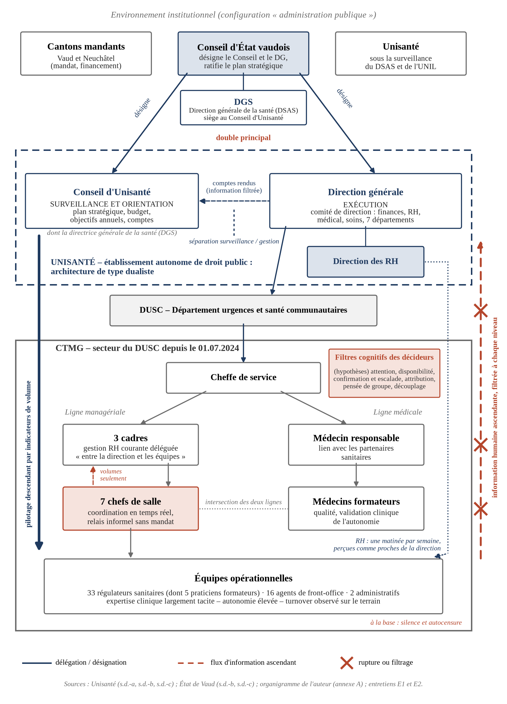

## Introduction et démarche

Depuis son rattachement à Unisanté en juillet 2024, la Centrale téléphonique des médecins de garde (CTMG) semble avoir retrouvé une stabilité institutionnelle : sortie de crise, nouvelle tutelle, encadrement renouvelé. Vue du terrain, la situation est moins apaisée. Des départs se sont succédé et Unisanté a conduit un audit interne, dont les collaborateurs n'ont pas connu les conclusions. Ils ont en revanche reçu, peu après, un message des ressources humaines exprimant leur confiance envers la direction du service. L'un des chefs de salle interrogés résume ainsi la situation : « aujourd'hui les structures existent […]. Mais ce qui manque encore, c'est la confiance entre ces différents niveaux » (E1).

C'est de ce décalage que part le présent audit. Organes, procédures et acteurs RH sont en place ; le problème tient à la manière dont l'information humaine circule, ou ne circule pas, entre le terrain et les instances qui gouvernent. La question qui guide le travail est donc la suivante : **en quoi la structure de gouvernance, la délégation de la fonction RH et les filtres cognitifs des décideurs limitent-ils la prise en compte des enjeux humains à la CTMG, et de quels leviers le Conseil d'Unisanté dispose-t-il pour y remédier ?**

**Cadre d'analyse.** Nous suivons la grille d'audit proposée dans le module (Bédat, 2026) : configuration organisationnelle, structure de gouvernance, acteurs clés, biais cognitifs, enjeux de délégation, puis diagnostic et recommandations. Trois apports théoriques structurent la lecture. Le premier est la gouvernance d'entreprise comportementale de Charreaux (2005). Aux approches disciplinaires, qui voient dans la gouvernance un moyen de contrôler les dirigeants et de réduire l'asymétrie d'information (Fama & Jensen, 1983 ; Jensen & Meckling, 1976), s'ajoutent les approches cognitives, centrées sur la production de connaissance et l'apprentissage, ainsi qu'une dimension comportementale : dirigeants et administrateurs ont des biais, que les mécanismes de gouvernance peuvent corriger ou amplifier. Notre hypothèse centrale en découle : à la CTMG, les leviers disciplinaires (indicateurs, contrôle, procédures) l'emportent sur les leviers cognitifs, alors que la difficulté est cognitive, l'institution ne sachant pas, ou ne cherchant pas à savoir, ce qui se passe sur le terrain. Le deuxième apport est celui des perspectives fondées sur les ressources (Prévot et al., 2010). L'expertise des régulateurs, en grande partie tacite, est précieuse, rare et difficile à imiter (Barney, 1991), mais elle doit encore être structurée et mobilisée, ce que Sirmon et al. (2011) appellent l'orchestration des ressources. Une expertise qui s'en va avec les personnes qui partent n'est plus orchestrée : elle est perdue. Le troisième apport concerne le rôle de la fonction RH. Walker (2026) rappelle que les RH ne sont pas un médiateur neutre et qu'elles agissent d'abord pour l'organisation, ce qui éclaire les attentes déçues exprimées dans les entretiens.

**Position de l'auteur et zones d'ombre.** Nous occupons la fonction de chef de salle à la CTMG. Un chef de salle voit l'activité en temps réel et reçoit une grande partie de ce que les collègues n'expriment pas ailleurs. Il n'a en revanche accès ni aux informations internes des ressources humaines d'Unisanté (dossiers, statistiques de rotation et d'absentéisme, entretiens de départ), ni au rapport de l'audit interne, ni aux délibérations du Conseil, de la direction générale ou de la direction du service. Nous ne pouvons donc produire aucune donnée interne chiffrée. Le turnover et l'absentéisme dont il sera question sont observés sur le terrain : départs successifs, remplacements à organiser, périodes de sous-effectif. Ils ne sont pas mesurés, et nous les présentons comme tels.

Le matériau mobilisé comprend donc nos observations de terrain et deux entretiens semi-directifs avec des collaborateurs de première ligne. Le premier a été mené avec un chef de salle, également infirmier régulateur, en septembre 2026 (E1). Le second a été conduit avec une régulatrice sanitaire, praticienne formatrice, en novembre 2024 pour un travail antérieur du cursus, le module 002, et il est réutilisé ici avec son autorisation (E2). S'y ajoutent des sources institutionnelles publiques pour les faits. Ce choix découle d'une contrainte, mais il a un intérêt propre : l'information de terrain est précisément celle dont nous faisons l'hypothèse qu'elle ne parvient pas aux organes de gouvernance. Qu'un chef de salle ne puisse pas savoir ce que l'audit interne a conclu est déjà, en soi, une observation sur l'asymétrie d'information.

Cette proximité expose aussi à des biais. Les deux personnes interrogées appartiennent à notre environnement professionnel, et notre propre lecture de la situation peut orienter l'interprétation dans le sens de ce que nous pensions déjà, c'est-à-dire un biais de confirmation. Pour limiter ce risque, nous avons recoupé les faits avec des sources publiques chaque fois que c'était possible. Nous formulons comme des hypothèses les interprétations qui portent sur des acteurs non interrogés : la direction, les RH, le Conseil. Nous avons aussi retenu les éléments qui nuancent le diagnostic, et E1 en apporte plusieurs. Toutes les personnes sont anonymisées, et nous désignons les fonctions plutôt que les individus. Un audit adressé à un conseil a vocation à décrire des mécanismes, non à instruire un dossier contre des personnes.

---

## 1. Présentation de l'organisation

### 1.1 Mission et statut

La CTMG est une ligne téléphonique publique, financée par le contribuable, au service de la population des cantons de Vaud et de Neuchâtel, qui la mandatent. Elle constitue l'un des éléments du dispositif d'urgence et de santé communautaire de ces deux cantons (Unisanté, s.d.-c). Elle évalue les demandes d'aide médicale et de détresse psychologique hors urgence vitale et les oriente vers la ressource adaptée (médecin de garde, urgences, centrale 144, médecin traitant, conseil), en lien avec de nombreux partenaires sanitaires et sociaux.

Depuis le 1er juillet 2024, la CTMG est un secteur du Département urgences et santé communautaires (DUSC) d'Unisanté (Unisanté, s.d.-c). Unisanté est un établissement autonome de droit public vaudois, doté d'une personnalité juridique propre, placé sous la surveillance du Département de la santé et de l'action sociale (DSAS) et de l'Université de Lausanne (Unisanté, 2022). Cette appartenance à la sphère publique conditionne sa gouvernance comme sa gestion des ressources humaines (section 2).

### 1.2 Une trajectoire institutionnelle récente et agitée

Jusqu'en 2024, la CTMG était gérée, comme la centrale 144, par la Fondation Urgences Santé. Après des travaux engagés à l'été 2022 sous l'égide du DSAS, le Conseil d'État vaudois a décidé de rattacher les deux centrales à deux entités distinctes : le 144 au CHUV, la CTMG à Unisanté. Ce choix a conduit à la dissolution de fait de la Fondation (CHUV, s.d. ; État de Vaud, s.d.-a). Pendant cette transition, conduite entre 2022 et 2024, la centrale a été placée sous la tutelle de l'État-major cantonal de conduite (EMCC), selon les collaborateurs (E1). À l'interne, le poste de cheffe de service a été créé et pourvu en septembre 2022. Les trois cadres de proximité de l'époque ont démissionné successivement et ont été remplacés.

Le témoignage de E1 invite à distinguer trois temps. Le premier est la crise de la Fondation, qui opposait selon lui les anciens cadres au conseil d'administration : « à cette époque, je ne me souviens pas d'un problème particulier de confiance entre les collaborateurs et leur hiérarchie ». Le deuxième est la période de tutelle, pendant laquelle la nouvelle cheffe de service est arrivée. Le troisième commence après le rattachement : « progressivement, la confiance s'est dégradée », avec « des tensions, des départs et des situations managériales que des collègues ont mal vécues » (E1). La crise de confiance actuelle n'est donc pas un héritage de la Fondation : elle est apparue dans le nouveau cadre institutionnel, et c'est là qu'il faut en chercher les ressorts.

### 1.3 Organisation interne

La CTMG compte une cheffe de service, trois cadres, une médecin responsable, sept chefs de salle, deux collaboratrices administratives, des médecins formateurs, seize agents de front-office et trente-trois régulateurs sanitaires (organigramme établi par l'auteur, annexe A). Les agents de front-office assurent la première réponse et écartent l'urgence vitale. Les régulateurs, de formation infirmière, évaluent et orientent les demandes. Les chefs de salle, eux-mêmes régulateurs, coordonnent à tour de rôle la centrale en temps réel et font le lien avec l'encadrement, sans autorité hiérarchique. Cinq praticiens formateurs issus des régulateurs forment les nouveaux collaborateurs, pendant jusqu'à trois mois (E2). Une ligne médicale (médecin responsable, médecins formateurs) coexiste avec cette ligne managériale, ce que nous analyserons en section 3.

### 1.4 Enjeux stratégiques

L'enjeu principal de la CTMG est la continuité et la qualité d'une prestation de santé publique assurée jour et nuit. Elle repose presque entièrement sur le jugement clinique de régulateurs expérimentés. E2 en donne un exemple frappant : une patiente jugée « cinglée » par plusieurs interlocuteurs, chez qui la régulatrice reconnaît, grâce à son expérience en Afrique de l'Ouest, une parasitose tropicale, et pour qui elle obtient une consultation spécialisée. Cette compétence s'acquiert lentement et se transmet mal : la fidélisation des collaborateurs conditionne donc directement la mission.

---

## 2. Configuration organisationnelle et facteurs environnementaux

### 2.1 Une configuration d'administration publique hybride

La CTMG relève d'une configuration d'administration publique hybride, qui combine règles bureaucratiques et outils managériaux issus de la nouvelle gestion publique (Emery & Giauque, 2014) : publique par son financement et sa mission, elle est pilotée au moyen d'indicateurs d'activité.

**Une pluralité de principaux.** Dans le secteur public, la relation d'agence s'étend sur une chaîne de délégations dans laquelle chaque agent répond à plusieurs principaux, aux attentes pas toujours convergentes (Waterman & Meier, 1998). La chaîne de la CTMG est longue (figure 1, annexe B). Chaque maillon accroît l'asymétrie d'information, et ce que sait le terrain n'arrive au sommet qu'après plusieurs filtrages successifs. Le Canton de Neuchâtel, mandant sans lien de gouvernance direct avec Unisanté, illustre en outre la dispersion des responsabilités propre à la délégation de missions publiques (Giauque, 2024).

**Une gouvernance à distance par les indicateurs.** Giauque (2024) décrit des autorités éloignées des lieux où le service est produit, qui recentralisent l'information au moyen d'indicateurs de plus en plus nombreux. Emery et Giauque (2019) en soulignent le paradoxe : les indicateurs rendent certaines dimensions de l'activité très visibles et en laissent d'autres dans l'ombre. À la CTMG, l'activité est d'abord suivie par des volumes : appels traités, prises en charge adultes et pédiatriques, taux d'activité. E2 regrette que, lors des briefings, « la seule chose positive qu'on balance, c'est que c'est des bons chiffres ». Elle ne rejette pas les indicateurs en tant que tels, mais le fait qu'ils soient présentés seuls : « pour expliquer les chiffres, il faut expliquer le reste ». Le module parle ici de « myopie de l'efficience » (Bédat, 2026).

**Autonomie et contrôle, valeurs et chiffres.** Giauque (2003) a montré que les réformes managériales du secteur public produisent une « bureaucratie libérale », qui promet l'autonomie tout en resserrant le contrôle. Les régulateurs disposent d'une autonomie clinique réelle (« on reste assez autonomes dans nos décisions », E2), mais leur travail est suivi par des indicateurs de productivité, avec ce « petit côté flicage » qu'E2 associe au suivi du taux d'activité. Ces injonctions contradictoires (Emery & Giauque, 2003) heurtent aussi la motivation de service public de soignants dont la première motivation reste « d'aider les gens » (E2 ; Vandenabeele et al., 2014). Or Ritz (2009) a montré, dans l'administration fédérale suisse, que cette motivation est associée à la performance organisationnelle perçue. La négliger a donc un coût pour l'organisation elle-même.

### 2.2 L'empreinte de la gestion de crise

Stinchcombe (1965) a montré que les organisations gardent durablement l'empreinte des conditions dans lesquelles elles ont été formées. L'encadrement actuel de la CTMG s'est constitué pendant une période de crise et de tutelle, où il fallait stabiliser un service fragilisé : privilégier le contrôle, les procédures et les indicateurs était alors sans doute rationnel. Notre hypothèse est que cette logique s'est maintenue au-delà de la crise : le contexte s'est stabilisé, mais le mode de pilotage n'a pas changé de nature. E1 le suggère lorsqu'il oppose une forme améliorée à un fond inchangé : « la manière dont les décisions sont prises, la place donnée aux remontées du terrain ou la confiance envers les collaborateurs, je trouve que ça reste assez similaire ».

Les difficultés de la CTMG s'inscrivent donc dans une configuration qui favorise la distance, la mesure et le contrôle, et pas seulement dans des comportements individuels. Reste à examiner la structure de gouvernance qui encadre ce fonctionnement.

## 3. Structure de gouvernance : une architecture de type dualiste

### 3.1 Les organes et leurs compétences

La CTMG est soumise à la gouvernance d'Unisanté, qui s'organise autour de deux organes distincts. Le Conseil d'Unisanté compte sept à huit membres, désignés par le Conseil d'État vaudois pour la législature 2022-2027. Il adopte le plan stratégique, qui doit ensuite être ratifié par le Conseil d'État, ainsi que le budget, les objectifs annuels et les comptes. Il valide aussi le contrat de prestations conclu avec le Département de la santé et de l'action sociale (DSAS). Parmi ses membres figure la directrice générale de la santé ad interim, qui dirige la Direction générale de la santé (DGS) rattachée au DSAS, c'est-à-dire une représentante de l'administration de tutelle (État de Vaud, s.d.-c ; Unisanté, s.d.-b). La direction générale est, elle aussi, désignée par le Conseil d'État (État de Vaud, s.d.-b). Le directeur général préside un comité de direction qui réunit les directions transversales (finances, ressources humaines, direction médicale, direction des soins) et les chefs des sept départements, dont le DUSC auquel appartient la CTMG (Unisanté, s.d.-a).

### 3.2 Une logique proche du modèle dualiste

Jungmann (2006) distingue deux grands systèmes de conseil. Le système moniste (*one-tier*) réunit dans un même organe la surveillance et la direction. Le système dualiste (*two-tier*), dont le modèle allemand est la référence, sépare un organe de surveillance d'un organe de direction, sans cumul de mandats entre les deux. Le droit suisse de la société anonyme relève du premier modèle, mais il permet au conseil d'administration de déléguer la gestion à une direction. Cela autorise, dans les faits, des configurations variées (Kunz, 2010), et la question de la séparation entre présidence et direction générale y reste débattue (Schmid & Zimmermann, 2008).

Unisanté n'est pas une société anonyme, et la comparaison a donc une valeur d'analogie plutôt que juridique. Son architecture se rapproche néanmoins nettement de la logique dualiste. Le Conseil oriente et contrôle, la direction générale et son comité de direction exécutent, et aucun des membres du Conseil identifiés dans les sources publiques n'appartient à la direction. La séparation entre surveillance et gestion est organique, et non seulement fonctionnelle. Cette qualification a des conséquences directes sur la manière dont les questions humaines peuvent, ou non, atteindre l'organe de surveillance.

### 3.3 Ce que cette architecture fait à l'orchestration RH

**Un contrôle indépendant, mais dépendant de l'information.** L'atout classique du dualisme est l'indépendance de l'organe de surveillance, qui n'a pas à contrôler ses propres décisions. Sa limite est symétrique : ne participant pas à la gestion, il dépend de ce que la direction lui transmet. Forbes et Milliken (1999) décrivent le conseil comme un groupe de décision épisodique, dont l'efficacité tient moins à sa composition qu'à ses processus : effort consenti, mobilisation des connaissances, débat contradictoire. Un conseil peut être parfaitement constitué et rester aveugle sur ce qu'on ne lui présente pas. Or l'information de la CTMG chemine du service au DUSC, puis au comité de direction et au Conseil, chaque étape la résumant. La dégradation du climat décrite par les collaborateurs a peu de chances d'y parvenir autrement que sous une forme très filtrée.

**Un double principal.** Le Conseil d'Unisanté ne nomme pas le directeur général : le Conseil d'État le désigne. Le levier disciplinaire le plus fort dont dispose un organe de surveillance, la capacité de choisir et de remplacer la direction, se trouve ainsi hors de sa portée. Le Conseil d'État intervient en outre à deux niveaux, puisqu'il désigne les membres du Conseil et ratifie le plan stratégique. On retrouve la pluralité des principaux décrite par Waterman et Meier (1998). La présence de l'administration de tutelle au sein même du Conseil ajoute une ambiguïté : elle peut faciliter la circulation de l'information entre l'État et l'établissement, mais elle brouille la frontière entre surveillance et tutelle que le modèle dualiste est censé garantir.

**Une fonction RH située du côté de l'exécutif.** La direction des ressources humaines siège au comité de direction, et donc à l'échelon exécutif. Les informations publiques que nous avons consultées ne font état d'aucune commission du Conseil consacrée aux ressources humaines. Hilb (2016) plaide précisément pour que les questions de personnel soient intégrées au travail du conseil lui-même. Lima et Galleli (2021) ainsi que Martin et al. (2016) montrent que l'articulation entre gouvernance et GRH stratégique peut prendre des formes très différentes selon la place que la gouvernance accorde au capital humain. Petrovic et al. (2018) voient dans la gouvernance le « chaînon manquant » entre les pratiques RH et la performance. La configuration observée à Unisanté place la GRH du côté de la mise en œuvre. Les questions humaines ne deviennent un objet de gouvernance que si l'exécutif choisit de les porter devant le Conseil. Les travaux de Bédat (2024), qui portent justement sur l'influence des conseils d'administration sur la stratégie RH dans le contexte suisse, invitent à interroger ce point plutôt qu'à le tenir pour acquis.

**Un dualisme qui se répète dans le service.** Au sein de la CTMG, une ligne managériale (cheffe de service, cadres, chefs de salle) coexiste avec une ligne médicale (médecin responsable, médecins formateurs, validation clinique de l'autonomie des régulateurs). Les chefs de salle se trouvent à l'intersection des deux, sans autorité dans aucune.

En résumé, la structure de gouvernance protège l'indépendance du contrôle, mais elle rend le Conseil dépendant d'une information que produit l'exécutif, et elle place la fonction RH du même côté que cet exécutif. Ce n'est pas une défaillance de conception, mais une vulnérabilité : tout dépend de la qualité de la remontée d'information. La figure 1 (annexe B) représente cette architecture et les flux qui la traversent. La section suivante examine comment les acteurs en situation assurent cette remontée.

---

## 4. Acteurs clés, délégation et jeux de pouvoir

### 4.1 La chaîne des délégations

Le module présente l'orchestration comme une succession de délégations, de l'assemblée générale au management intermédiaire (Bédat, 2026). Transposée à la CTMG, cette chaîne va du Conseil d'État au Conseil d'Unisanté, puis à la direction générale et à son comité de direction, au DUSC, à la cheffe de service, aux cadres, et enfin aux chefs de salle et aux équipes. Cette chaîne est représentée dans la figure 1 (annexe B). Le tableau suivant confronte le rôle formel de chaque acteur à ce qu'en perçoivent les collaborateurs de terrain. Pour les acteurs que nous n'avons pas interrogés, la colonne de droite décrit une perception, et non un fait établi.

| Acteur | Rôle formel | Rôle perçu depuis le terrain |
|---|---|---|
| Conseil d'Unisanté | Orienter, surveiller, adopter le plan et les objectifs | Absent des récits : aucune trace de son action n'est visible depuis le service |
| Direction générale, DUSC | Conduire l'établissement et le département | Commanditaire de l'audit interne, dont les conclusions ne sont pas communiquées |
| Direction des RH | Politique RH, appui aux services | Distante (« un RH vient une matinée par semaine »), perçue comme proche de la direction (E1) |
| Cheffe de service | Piloter le service, interface avec Unisanté | Pilotage centré sur l'activité, communication plus mesurée depuis un accompagnement managérial (E1) |
| Cadres | Encadrement du personnel, gestion RH courante | « Entre la cheffe de service et les équipes », identifiés à la ligne hiérarchique (E1) |
| Chefs de salle | Coordination en temps réel, relais | Confidents du terrain : « on n'a pas vraiment de pouvoir de décision » (E1) |

**Parties prenantes externes.** Au-delà de la chaîne hiérarchique, la CTMG se situe au cœur d'un réseau de parties prenantes (Freeman, 1984) : la population des deux cantons, les médecins de garde et les partenaires sanitaires et sociaux qui dépendent de la qualité de l'orientation, et le Canton de Neuchâtel, mandant sans voix dans la gouvernance d'Unisanté. Aucune ne perçoit une dégradation du climat interne avant qu'elle n'affecte la prestation.

### 4.2 Une fonction RH déléguée et à distance

Reichel et Lazarova (2013) distinguent deux mouvements qui transforment la position des départements RH : l'externalisation de certaines activités et la délégation de la gestion quotidienne du personnel aux managers de ligne. Gooderham et al. (2015) montrent que cette délégation dépend autant de facteurs nationaux que de choix propres à l'organisation. À la CTMG, les RH d'Unisanté sont centralisées et ne travaillent pas dans le service ; la gestion courante des collaborateurs repose sur les cadres de proximité, et la présence RH sur place se limite à une matinée par semaine, dont, selon E1, peu de collègues se saisissent.

Cette organisation devient problématique lorsque le relais managérial ne fonctionne pas, comme l'illustre le cas des deux praticiennes formatrices rapporté par E2. Sélectionnées pour cette fonction et en poste depuis juillet 2024, elles ont exercé cinq mois sans contrat ni ajustement salarial, malgré des relances orales auprès de leur hiérarchie directe (« oui, oui t'inquiète pas, ça va venir »). La situation ne s'est débloquée qu'après l'envoi d'un courrier écrit, rédigé sur le conseil d'un chef de salle. La régularisation a alors été rapide et rétroactive. Le circuit formel existe donc, mais c'est un détour informel qui l'a activé. E2 le résume sans détour : « ce n'est pas l'institution qui m'a aidé ».

Les cadres se trouvent dans la position paradoxale que le module attribue aux cadres intermédiaires du secteur public (Bédat, 2026). Chargés de relayer les décisions et de porter la gestion RH courante, ils sont perçus par les équipes comme l'incarnation de la ligne hiérarchique, et subissent par conséquent la baisse de confiance envers la direction : « quand la confiance envers la direction baisse, ça finit forcément par avoir un effet sur eux aussi » (E1). E1 refuse d'ailleurs de « tous les mettre dans le même panier », ce qui rappelle que la difficulté tient à la position plus qu'aux personnes.

Les chefs de salle occupent une place singulière. Sans lien hiérarchique avec leurs collègues, ils reçoivent ce qui ne se dit pas ailleurs : « les collègues viennent souvent nous parler de manière informelle » (E1). E2 explique que c'est justement l'absence de lien hiérarchique qui a rendu possible une discussion ouverte, alors que la même question adressée aux cadres « était vécue comme une agression ». Les chefs de salle jouent ainsi un rôle d'intermédiaire entre deux mondes, comparable à celui que le module décrit pour les *boundary spanners*, ces acteurs qui traduisent d'une logique à l'autre (Bonnet et al., 2017). Mais ce rôle n'est ni reconnu ni outillé. Ce que les chefs de salle transmettent formellement à l'encadrement, ce sont des volumes d'appels. Les signaux humains qu'ils recueillent restent à leur niveau.

### 4.3 Pouvoir, crédibilité et silence

La fonction RH ne dispose pas seulement d'un pouvoir formel. Son influence repose aussi sur sa crédibilité auprès des différents acteurs (Aldrich et al., 2015 ; Sheehan et al., 2014). Or l'épisode qui a suivi l'audit interne a entamé cette crédibilité auprès des équipes. Les collaborateurs avaient exprimé leurs difficultés, et ils n'ont reçu aucun retour sur les conclusions. Ils ont en revanche reçu un message des RH exprimant leur confiance envers la direction. E1 précise que la réaction négative ne venait pas d'une attente de prise de position contre la direction. Elle venait du sentiment que « leur parole n'avait pas vraiment de poids ». Depuis, une partie des collaborateurs « perçoit les RH comme étant plus proches de la direction que des équipes » (E1).

Walker (2026) rappelle que les RH ne sont pas un médiateur neutre. Le problème, à la CTMG, n'est pas que les RH soutiennent l'organisation, ce qui relève de leur rôle, mais que les collaborateurs, faute d'autre canal, espéraient d'elles cet « espace neutre » (E1) que rien d'autre ne leur offre. Cet espoir déçu a renforcé le repli vers les canaux informels : « même si le RH est présent, certains vont plutôt parler à un collègue ou à un chef de salle » (E1).

Le pouvoir s'exerce aussi, comme l'a montré Hardy (1996), par le contrôle des processus et du sens, c'est-à-dire par ce qui peut être dit, où et par qui. Les entretiens décrivent un apprentissage progressif du silence. E1 observe que « certains ont commencé à faire attention à ce qu'ils disaient et à qui ils le disaient ». E2 rapporte qu'une collègue a été reprise pendant une demi-heure dans un bureau après avoir posé en public une question sur le calcul des horaires, et elle en tire une règle de conduite personnelle : « je ne veux pas m'attirer les foudres ». Nous ne pouvons pas vérifier la manière dont ces épisodes ont été vécus de l'autre côté. Leur effet sur le comportement des collaborateurs est en revanche clairement exprimé : on se tait, ou on parle seulement entre pairs (Pfeffer, 1992).

Le mécanisme se précise ainsi. Le Conseil dépend de l'information transmise par l'exécutif ; la délégation RH confie la remontée des difficultés à une ligne managériale qui les vit comme des mises en cause ; les chefs de salle qui recueillent cette information n'ont ni mandat ni outils pour la transmettre ; la perte de crédibilité des RH ferme le dernier canal. Reste à comprendre pourquoi les décideurs ne cherchent pas à combler ce vide : c'est l'objet de l'analyse des biais cognitifs.

## 5. Biais cognitifs et filtres de décision

Les sections précédentes décrivent un circuit d'information défaillant. Elles n'expliquent pas pourquoi ceux qui se trouvent en haut de la chaîne ne cherchent pas davantage à le réparer. Charreaux (2005) invite à prendre au sérieux cette question : les dirigeants et les administrateurs ne sont pas des décideurs parfaitement rationnels, et leurs biais font partie des mécanismes de gouvernance eux-mêmes. Les décideurs concernés (direction du service, DUSC, RH, Conseil) n'ont pas été interrogés. Les biais présentés ici sont donc des hypothèses construites à partir de ce qui est observable depuis le terrain, et non des diagnostics posés sur des personnes. Pour chacun, nous indiquons ce qui dans les données le suggère, le mécanisme en jeu et ce qu'il produit sur l'orchestration RH.

### 5.1 Filtre d'attention : ce que l'organisation rend visible

Ocasio (1997) propose de comprendre le comportement des organisations à partir de la manière dont elles distribuent l'attention de leurs décideurs. L'attention est une ressource rare. Ce sur quoi elle se porte dépend moins des préférences individuelles que des canaux, des règles et des procédures que l'organisation met à disposition. Une question qui ne dispose d'aucun canal pour atteindre les décideurs a peu de chances de retenir leur attention, quelle que soit son importance.

À la CTMG, les canaux existants transportent surtout des volumes. Les chefs de salle rendent compte des appels traités, adultes et pédiatriques. Il existe une procédure structurée pour déclarer les événements indésirables techniques (« quoi, où, comment, qu'est-ce qui l'a déclenché »), mais aucune pour ce qui relève du managérial ou de la charge vécue : « on ne l'a pas pour tout ce qui est d'ordre managérial » (E2). Nul ne demande combien d'appels agressifs ont été reçus, ni ce qu'il advient d'un régulateur qui vient de vivre le suicide d'un appelant en ligne. E2 rapporte que la consigne se résume alors à « prends ta pause plus tôt ». Dans une telle architecture, la direction ne choisit pas délibérément d'ignorer l'humain : l'organisation de l'attention le rend invisible. C'est un point important pour le Conseil, car il fait passer le problème du registre du comportement individuel à celui de la conception des dispositifs, qui relève de la gouvernance.

### 5.2 Heuristique de disponibilité : juger sur ce qui remonte

L'heuristique de disponibilité conduit à estimer l'importance d'un phénomène selon la facilité avec laquelle des exemples viennent à l'esprit (Tversky & Kahneman, 1974), et le jugement intuitif s'appuie sur ce qui est immédiatement accessible sans chercher ce qui manque (Kahneman, 2012). Un organe qui ne reçoit ni plainte formelle, ni alerte, ni indicateur dégradé conclura donc assez naturellement que la situation est maîtrisée. Or, à la CTMG, l'absence de plainte résulte en partie du silence décrit en section 4.3. Les décideurs risquent de tirer une conclusion rassurante d'une absence d'information que le problème lui-même produit.

### 5.3 Biais de confirmation et escalade d'engagement

L'épisode de l'audit interne est le plus délicat à interpréter, et le plus important. Unisanté a lancé un audit, ce qui témoigne d'une volonté réelle de comprendre. Les conclusions n'ont pas été communiquées aux collaborateurs, et les RH ont ensuite exprimé leur confiance envers la direction du service (E1).

Schwenk (1988) recense parmi les biais les plus fréquents de la décision stratégique la tendance à interpréter les informations nouvelles à la lumière des croyances préalables, en retenant ce qui les confirme. Simonson et Staw (1992) montrent de leur côté comment les décideurs persistent dans une voie engagée lorsqu'ils s'en sentent personnellement responsables, et comment certaines techniques, comme fixer à l'avance des seuils d'alerte ou évaluer les décideurs sur la qualité de leur processus plutôt que sur l'issue, réduisent cette escalade. L'hypothèse que nous formulons est la suivante. La fonction de cheffe de service a été créée et pourvue par l'institution pendant la tutelle, dans un contexte de crise. Remettre en cause la manière dont le service est dirigé reviendrait, pour l'institution, à réexaminer ses propres choix. Le risque est alors de lire les résultats d'un audit dans le sens le plus compatible avec la décision initiale, et de réaffirmer publiquement son engagement plutôt que d'ouvrir la question.

Cette hypothèse doit être tenue à distance, car d'autres explications sont plausibles. L'audit peut n'avoir rien révélé qui justifie un changement. Les RH peuvent être tenues à un devoir de réserve sur son contenu. L'accompagnement managérial dont la direction a bénéficié, que E1 a appris de manière informelle, peut être la réponse que l'institution a jugée proportionnée, et il a d'ailleurs produit des effets visibles sur la communication. Mais c'est précisément parce que plusieurs lectures sont possibles que l'absence de restitution pose problème. Faute d'information, les collaborateurs retiennent la plus défavorable : leur parole « n'avait pas vraiment de poids » (E1).

### 5.4 Erreur d'attribution : imputer aux personnes ce qui relève du système

L'erreur fondamentale d'attribution désigne la tendance à expliquer les comportements d'autrui par ses dispositions personnelles plutôt que par la situation. McCormick et Martinko (2004) ont montré que les attributions causales que font les leaders sur la performance de leurs collaborateurs orientent directement leurs réactions. Barker et Barr (2002) observent que les dirigeants qui attribuent un déclin à des causes internes sont plus enclins à engager une réorientation que ceux qui l'attribuent à des causes extérieures à leur propre action.

Les entretiens suggèrent des attributions de ce type. Un arrêt maladie de cinq jours est traité comme un manquement individuel à une procédure, et non comme le signe possible d'une charge de travail en période de sous-effectif (E2). Une collaboratrice décrite comme « dans la revendication » finit par partir, et son départ est vécu par ses collègues comme l'aboutissement d'une mise à l'écart, alors que, selon E2, elle disait « des choses qui pouvaient être vraies ». Si chaque départ est lu comme un cas particulier (une personnalité difficile, un projet personnel, une inadaptation au poste), la série des départs ne devient jamais un phénomène organisationnel. Pour reprendre Barker et Barr, l'absence d'attribution interne rend la réorientation improbable. Le même mécanisme peut jouer au niveau du Conseil, dont l'évaluation de la direction dépend des attributions qu'il fait des difficultés qu'on lui rapporte (Haleblian & Rajagopalan, 2006).

### 5.5 Le risque de pensée de groupe

Janis (1972) décrit la pensée de groupe comme la tendance d'un groupe soudé, sous pression, à privilégier l'unanimité au détriment de l'examen critique, notamment en écartant les informations dérangeantes. Nous n'avons aucune donnée sur le fonctionnement interne de la direction du service, du DUSC ou des RH, et il serait abusif d'affirmer que ce mécanisme y est à l'œuvre. Les conditions qui le favorisent sont toutefois réunies : une coalition dirigeante constituée en période de crise, soucieuse de stabilité et exposée aux critiques du terrain. Le message de soutien des RH, qui présente la ligne dirigeante comme unie, est compatible avec cette lecture sans en constituer une preuve.

### 5.6 Découplage : changer la forme sans changer le fond

E1 fait une distinction qui résume bien la situation. Depuis l'accompagnement managérial, la communication est « plus mesuré[e], plus calme, certaines choses sont mieux formulées ». Mais « sur le fond », il ne voit « pas encore de changement majeur dans la gouvernance ». Gioia et Chittipeddi (1991) ont décrit le travail de production de sens (*sensegiving*) par lequel les dirigeants cherchent à orienter la manière dont les autres interprètent une situation. Weick (1995) rappelle que chacun construit le sens de ce qu'il vit à partir d'indices, et que les collaborateurs interprètent aussi bien les silences que les messages. Ici, l'effort porte sur la formulation, alors que ce qui est interprété par les équipes, ce sont les actes.

Meyer et Rowan (1977) offrent la lecture la plus éclairante de cet épisode. Ils ont montré que les organisations adoptent des structures formelles qui répondent aux attentes de leur environnement institutionnel, et les découplent parfois de leur fonctionnement réel. Ce découplage s'accompagne d'une « logique de confiance » : on affirme sa confiance dans les acteurs et on évite l'inspection approfondie de ce qui se passe réellement. Un audit sans restitution, suivi d'un message de confiance, correspond presque terme à terme à cette description. L'audit remplit sa fonction de légitimité, puisque l'institution a agi, sans produire l'apprentissage qu'on pouvait en attendre.

### 5.7 Synthèse : une boucle qui s'auto-entretient

Côté terrain, les collaborateurs ont appris à se taire (section 4.3). Ce silence alimente directement les biais décrits plus haut : les décideurs raisonnent sur une information déjà filtrée, jugent la situation maîtrisée et attribuent les difficultés résiduelles à des cas individuels. Les départs se poursuivent, sans que les indicateurs suivis ne les rendent visibles comme un phénomène d'ensemble. La boucle se referme ainsi, comme le montrent les deux flux opposés de la figure 1 (annexe B). Des canaux centrés sur le volume structurent l'attention, l'humain reste invisible, les difficultés sont attribuées aux personnes et l'engagement initial est confirmé, la parole se tait, et les indicateurs continuent de ne rien montrer.

Une précaution s'impose au terme de cette section. Tetlock (2000) a montré que la détection des biais dépend aussi du point de vue de celui qui les observe : ce que l'un qualifie de biais, l'autre peut le considérer comme une prudence légitime. Notre position de chef de salle nous rend plus attentif aux biais des décideurs qu'aux nôtres. C'est une raison supplémentaire pour présenter ces analyses comme des hypothèses que seule une démarche contradictoire, incluant la direction et les RH, permettrait de confirmer.

---

## 6. Facteurs facilitant ou limitant le positionnement stratégique de la fonction RH

Boxall (1996) distingue la qualité du capital humain et celle des processus qui le mobilisent ; selon la formule du module, un capital humain qualifié « reste stérile s'il n'est pas managé par des pratiques RH structurées, initiées par la gouvernance » (Bédat, 2026). La CTMG présente ce décalage.

Les facteurs facilitants sont réels. Le capital humain, fait d'infirmiers expérimentés et autonomes, est une ressource précieuse, rare et difficile à imiter (Barney & Wright, 1998). Les solidarités entre collègues ont montré leur efficacité. Du côté institutionnel, l'audit commandé montre que l'institution sait se saisir d'un signal, la communication de la direction s'est améliorée (E1), un représentant des RH est présent chaque semaine, et Unisanté dispose d'un département consacré à la santé au travail.

Les facteurs limitants correspondent aux mécanismes analysés dans les sections précédentes : distance et perte de crédibilité des RH, pilotage par les volumes, absence de la fonction RH au niveau du Conseil, absence d'espaces d'écoute et de débriefing, circuits contractuels lents. Brandl et Pohler (2010) rappellent que le rôle du département RH dépend largement des attentes que la direction générale nourrit à son égard. Rien n'indique qu'à la CTMG la fonction RH soit attendue comme partenaire stratégique : elle apparaît comme instance administrative et, lors de l'audit, comme soutien de la ligne hiérarchique. Or, dans le secteur public suisse, les pratiques RH agissent sur la performance notamment par l'intermédiaire de la motivation intrinsèque des agents (Giauque et al., 2013). Dans un service qui repose sur la motivation de soignants, ce positionnement n'est pas secondaire.

---

## 7. Risques, enjeux éthiques et points de vigilance

### 7.1 Les risques

**Un risque de perte de capital humain.** L'expertise des régulateurs est en grande partie tacite : elle relève de ce que Polanyi (1966) décrivait comme un savoir que l'on possède sans pouvoir entièrement l'énoncer. Elle se transmet par la pratique partagée et le compagnonnage bien plus que par des procédures (Nonaka & Takeuchi, 1995 ; Lamari, 2010). Chaque départ emporte une part de ce savoir, et chaque arrivée impose jusqu'à trois mois de formation (E2). Le turnover observé sur le terrain, sans pouvoir être chiffré, a donc un coût cumulatif : il épuise ceux qui restent et qui forment, et abaisse le niveau d'expertise de la centrale.

**Un risque opérationnel et de sécurité des patients.** Une centrale en sous-effectif récurrent, dont les collaborateurs n'ont pas d'espace pour déposer la charge émotionnelle de leurs appels, voit augmenter le risque d'erreur d'orientation sur des situations parfois graves. E2 le formule à sa manière, en évoquant un « sac à dos » que l'on remplit sans jamais pouvoir le vider.

**Un risque de légitimité et de réputation.** Sortie d'une crise qui a conduit à la dissolution de l'entité qui la gérait, la CTMG remplit une mission de santé publique financée par l'impôt. Une nouvelle crise, liée au personnel ou à la qualité de la prestation, atteindrait aussi Unisanté, qui l'a accueillie. La question de la résilience organisationnelle, entre agilité et rigidité, se pose ici avec acuité (Giovannini & Giauque, 2023).

### 7.2 Les enjeux éthiques

Trois enjeux éthiques ressortent des entretiens. Le premier est la **santé psychique au travail** : l'absence de débriefing après des appels traumatiques expose les collaborateurs à une usure dont l'employeur porte la responsabilité. Le deuxième est la **protection de la parole** : lorsque des collaborateurs disent craindre des représailles et rapportent des épisodes qui nourrissent cette crainte, la question touche aux devoirs de l'employeur public. Nous n'avons pas vérifié ces épisodes, mais la perception est en soi un fait organisationnel. Le troisième est la **loyauté envers les personnes qui ont participé à l'audit interne** : ne leur donner aucun retour revient à traiter leur parole comme une simple ressource d'information.

### 7.3 Les points de vigilance

Deux précautions s'imposent : **ne pas personnaliser le diagnostic**, car les mécanismes identifiés survivraient à un changement de personne s'ils n'étaient pas traités pour eux-mêmes ; **garantir la confidentialité** de toute restitution ou dispositif d'écoute, car dans une équipe d'une soixantaine de personnes, un détail suffit à identifier son auteur.

---

## 8. Diagnostic et recommandations au Conseil d'Unisanté

### 8.1 Diagnostic

La CTMG ne souffre pas d'un manque de structures, mais de l'absence d'un dispositif qui permette à la gouvernance de **voir l'humain**. Au sens de Charreaux (2005), les leviers disciplinaires sont bien présents, les leviers cognitifs presque absents. L'architecture dualiste rend le Conseil dépendant de l'information produite par l'exécutif. La délégation RH confie la remontée des difficultés à une ligne managériale qui les vit comme des critiques, et les chefs de salle qui recueillent cette information n'ont aucun moyen de la transmettre. Les biais des décideurs entretiennent enfin une lecture rassurante de la situation.

Le Conseil n'a pas vocation à gérer le service : les recommandations qui suivent passent par ses compétences propres (objectifs annuels, plan stratégique, comptes rendus exigés de la direction générale, contrat de prestations).

### 8.2 Recommandations

Les recommandations sont classées par horizon : les recommandations 1 et 3 peuvent être engagées à court terme (trois à six mois), les recommandations 2, 4, 5 et 6 relèvent des objectifs de l'exercice suivant, et la septième ferme la boucle à douze mois.

**1. Demander une restitution de l'audit interne.** Le Conseil peut demander à la direction générale qu'une synthèse soit présentée aux collaborateurs : ce qui a été identifié, ce qui sera travaillé et selon quel calendrier. Il ne s'agit pas de publier le rapport, mais de trouver le « juste milieu » entre « tout dire et ne rien dire » qu'évoque E1, et de sortir ainsi de la logique de confiance décrite par Meyer et Rowan (1977).

**2. Faire de la santé organisationnelle un objet de gouvernance.** Le Conseil peut inscrire dans les objectifs annuels un suivi d'indicateurs humains présentés au même niveau que les volumes d'activité : rotation, absentéisme, ancienneté, motifs de départ recueillis par une personne extérieure au service. Ce qui dispose d'un canal peut enfin être vu (Ocasio, 1997), et les questions de personnel entrent dans le travail du Conseil (Hilb, 2016).

**3. Créer un canal de remontée indépendant de la hiérarchie.** Une personne de confiance extérieure au service, ou une enquête anonyme régulière dont les résultats sont communiqués, offrirait l'« espace neutre » attendu des RH et corrigerait l'autocensure décrite en sections 4.3 et 5.7.

**4. Outiller les décisions touchant les personnes contre les biais.** Avant de réaffirmer une confiance ou de clore un dossier sensible, la direction générale et les RH peuvent utiliser la grille de Kahneman, Lovallo et Sibony (2011), ainsi que l'analyse pré-mortem (Klein, 2007). Fixer à l'avance des seuils d'alerte, par exemple un niveau de départs déclenchant une revue externe, réduit le risque d'escalade (Simonson & Staw, 1992).

**5. Clarifier et outiller la délégation RH.** Former les cadres de proximité à la gestion des personnes et à l'accueil de la critique ; reconnaître le rôle de relais des chefs de salle en ajoutant à leurs comptes rendus une remontée qualitative ; fixer des délais pour les décisions contractuelles.

**6. Institutionnaliser le débriefing** après les appels difficiles, avec l'appui des compétences d'Unisanté en santé au travail.

**7. Évaluer après douze mois**, par un tiers externe au service, avec cette fois une restitution aux équipes. C'est à cette condition que les collaborateurs pourront voir, selon les mots de E1, « que leur parole peut réellement avoir un effet sur le fonctionnement du service ».

Le tableau de l'annexe E synthétise ces recommandations, les mécanismes qu'elles visent et les indicateurs de suivi proposés.

---

## Conclusion

Cet audit est parti d'un constat de terrain : à la CTMG, les structures sont en place, mais la confiance entre les niveaux ne l'est pas. Ce déficit ne tient pas seulement aux personnes : il résulte d'une gouvernance à distance par les volumes, d'une architecture dualiste qui rend le Conseil dépendant de l'exécutif, d'une fonction RH déléguée et perçue comme alignée sur la direction, et de biais qui transforment l'absence d'information en signe de maîtrise. Les recommandations visent à réparer un circuit : que ce que voit le terrain atteigne ceux qui gouvernent, et que ces derniers y répondent visiblement.

Ce travail repose sur deux entretiens et sur nos observations de chef de salle, sans accès aux données internes des RH ni au point de vue de la direction, des RH ou du Conseil. Plusieurs interprétations restent des hypothèses, qu'une démarche contradictoire entendant les autres acteurs permettrait de vérifier. C'est d'ailleurs, en un sens, ce que recommande cet audit.

## Bibliographie

### Références scientifiques

Aldrich, P., Dietz, G., Clark, T., & Hamilton, P. (2015). Establishing HR professionals' influence and credibility: Lessons from the capital markets and investment banking sector. *Human Resource Management, 54*(1), 105–130.

Barker, V. L., III, & Barr, P. S. (2002). Linking top manager attributions to strategic reorientation in declining firms attempting turnarounds. *Journal of Business Research, 55*(12), 963–979.

Barney, J. (1991). Firm resources and sustained competitive advantage. *Journal of Management, 17*(1), 99–120. https://doi.org/10.1177/014920639101700108

Barney, J. B., & Wright, P. M. (1998). On becoming a strategic partner: The role of human resources in gaining competitive advantage. *Human Resource Management, 37*(1), 31–46.

Bonnet, C., Séville, M., & Wirtz, P. (2017). Genèse et fonctionnement du conseil d'administration d'une firme entrepreneuriale : le rôle des identifications sociales des administrateurs. *Finance Contrôle Stratégie, 20*(3).

Boxall, P. (1996). The strategic HRM debate and the resource-based view of the firm. *Human Resource Management Journal, 6*(3), 59–75.

Brandl, J., & Pohler, D. (2010). The human resource department's role and conditions that affect its development: Explanations from Austrian CEOs. *Human Resource Management, 49*(6), 1025–1046.

Bédat, J. (2024). *The influence of the board of directors on HR strategy: Three qualitative studies in a Swiss context* [Thèse de doctorat, Université Jean Moulin Lyon III].

Charreaux, G. (2005). Pour une gouvernance d'entreprise « comportementale » : une réflexion exploratoire... *Revue française de gestion, 157*(4), 215–238.

Emery, Y., & Giauque, D. (2003). Emergence of contradictory injunctions in Swiss NPM projects. *International Journal of Public Sector Management, 16*(6), 468–481.

Emery, Y., & Giauque, D. (2014). L'univers hybride de l'administration au XXIe siècle. Introduction. *Revue Internationale des Sciences Administratives, 80*(1), 25–34.

Emery, Y., & Giauque, D. (2019). Les paradoxes d'une gouvernance publique à distance par les indicateurs. In *Manager les paradoxes dans le secteur public* (pp. 9–30).

Fama, E. F., & Jensen, M. C. (1983). Separation of ownership and control. *The Journal of Law and Economics, 26*(2), 301–325.

Forbes, D. P., & Milliken, F. J. (1999). Cognition and corporate governance: Understanding boards of directors as strategic decision-making groups. *Academy of Management Review, 24*(3), 489–505.

Freeman, R. E. (1984). *Strategic management: A stakeholder approach*. Pitman.

Giauque, D. (2003). New public management and organizational regulation: The liberal bureaucracy. *International Review of Administrative Sciences, 69*(4), 567–592.

Giauque, D. (2024). Une nouvelle économie politique des administrations publiques : la gouvernance à distance. *Éthique publique, 25*(2).

Giauque, D., Anderfuhren-Biget, S., & Varone, F. (2013). HRM practices, intrinsic motivators, and organizational performance in the public sector. *Public Personnel Management, 42*(2), 123–150.

Gioia, D. A., & Chittipeddi, K. (1991). Sensemaking and sensegiving in strategic change initiation. *Strategic Management Journal, 12*(6), 433–448.

Giovannini, C., & Giauque, D. (2023). La résilience organisationnelle, entre agilité et rigidité ? *Swiss Yearbook of Administrative Sciences, 14*(1), 73–84.

Gooderham, P. N., Morley, M. J., Parry, E., & Stavrou, E. (2015). National and firm-level drivers of the devolution of HRM decision making to line managers. *Journal of International Business Studies, 46*(6), 715–723.

Haleblian, J., & Rajagopalan, N. (2006). A cognitive model of CEO dismissal: Understanding the influence of board perceptions, attributions and efficacy beliefs. *Journal of Management Studies, 43*(5), 1009–1026.

Hardy, C. (1996). Understanding power: Bringing about strategic change. *British Journal of Management, 7*(S1), S3–S16.

Hilb, M. (2016). *New corporate governance: Successful board management tools* (5e éd.). Springer.

Janis, I. L. (1972). *Victims of groupthink: A psychological study of foreign-policy decisions and fiascoes*. Houghton Mifflin.

Jensen, M. C., & Meckling, W. H. (1976). Theory of the firm: Managerial behavior, agency costs and ownership structure. *Journal of Financial Economics, 3*(4), 305–360.

Jungmann, C. (2006). The effectiveness of corporate governance in one-tier and two-tier board systems: Evidence from the UK and Germany. *European Company and Financial Law Review, 3*(4), 426–474.

Kahneman, D. (2012). Two systems in the mind. *Bulletin of the American Academy of Arts and Sciences, 65*(2), 55–59.

Kahneman, D., Lovallo, D., & Sibony, O. (2011). Before you make that big decision. *Harvard Business Review, 89*(6), 50–60.

Klein, G. (2007). Performing a project premortem. *Harvard Business Review, 85*(9), 18–19.

Kunz, P. V. (2010). Swiss corporate governance: An overview. In *Rapports suisses présentés au XVIIIe Congrès international de droit comparé* (pp. 99–134).

Lamari, M. (2010). Le transfert intergénérationnel des connaissances tacites : les concepts utilisés et les évidences empiriques démontrées. *Télescope, 16*(1), 39–65.

Lima, L., & Galleli, B. (2021). Human resources management and corporate governance: Integration perspectives and future directions. *European Management Journal, 39*(6), 731–744.

Martin, G., Farndale, E., Paauwe, J., & Stiles, P. G. (2016). Corporate governance and strategic human resource management: Four archetypes and proposals for a new approach to corporate sustainability. *European Management Journal, 34*(1), 22–35.

McCormick, M. J., & Martinko, M. J. (2004). Identifying leader social cognitions: Integrating the causal reasoning perspective into social cognitive theory. *Journal of Leadership & Organizational Studies, 10*(4), 2–11.

Meyer, J. W., & Rowan, B. (1977). Institutionalized organizations: Formal structure as myth and ceremony. *American Journal of Sociology, 83*(2), 340–363.

Nonaka, I., & Takeuchi, H. (1995). *The knowledge-creating company: How Japanese companies create the dynamics of innovation*. Oxford University Press.

Ocasio, W. (1997). Towards an attention-based view of the firm. *Strategic Management Journal, 18*(S1), 187–206.

Petrovic, J., Saridakis, G., & Johnstone, S. (2018). An integrative approach to HRM–firm performance relationship: A missing link to corporate governance. *Corporate Governance, 18*(2), 331–352.

Pfeffer, J. (1992). *Managing with power: Politics and influence in organizations*. Harvard Business School Press.

Polanyi, M. (1966). The logic of tacit inference. *Philosophy, 41*(155), 1–18.

Prévot, F., Brulhart, F., & Guieu, G. (2010). Perspectives fondées sur les ressources : proposition de synthèse. *Revue française de gestion, 204*(5), 87–103.

Reichel, A., & Lazarova, M. (2013). The effects of outsourcing and devolvement on the strategic position of HR departments. *Human Resource Management, 52*(6), 923–946.

Ritz, A. (2009). La motivation de service public et la performance organisationnelle au sein de l'administration fédérale suisse. *Revue Internationale des Sciences Administratives, 75*(1), 59–86.

Schmid, M. M., & Zimmermann, H. (2008). Should chairman and CEO be separated? Leadership structure and firm performance in Switzerland. *Schmalenbach Business Review, 60*(2), 182–204.

Schwenk, C. R. (1988). The cognitive perspective on strategic decision making. *Journal of Management Studies, 25*(1), 41–55.

Sheehan, C., De Cieri, H., Cooper, B., & Brooks, R. (2014). Exploring the power dimensions of the human resource function. *Human Resource Management Journal, 24*(2), 193–210.

Simonson, I., & Staw, B. M. (1992). Deescalation strategies: A comparison of techniques for reducing commitment to losing courses of action. *Journal of Applied Psychology, 77*(4), 419–426.

Sirmon, D. G., Hitt, M. A., Ireland, R. D., & Gilbert, B. A. (2011). Resource orchestration to create competitive advantage: Breadth, depth, and life cycle effects. *Journal of Management, 37*(5), 1390–1412.

Stinchcombe, A. L. (1965). Social structure and organizations. In J. G. March (Ed.), *Handbook of organizations* (pp. 142–193). Rand McNally.

Tetlock, P. E. (2000). Cognitive biases and organizational correctives: Do both disease and cure depend on the politics of the beholder? *Administrative Science Quarterly, 45*(2), 293–326.

Tversky, A., & Kahneman, D. (1974). Judgment under uncertainty: Heuristics and biases. *Science, 185*(4157), 1124–1131.

Vandenabeele, W., Brewer, G. A., & Ritz, A. (2014). Past, present, and future of public service motivation research. *Public Administration, 92*(4), 779–789.

Walker, J. (2026, 23 juin). Le rôle des ressources humaines est-il d'aider les employés ? Voici ce que les jeunes professionnels doivent savoir. *The Conversation*. https://theconversation.com/le-role-des-ressources-humaines-est-il-daider-les-employes-voici-ce-que-les-jeunes-professionnels-doivent-savoir-279497

Waterman, R. W., & Meier, K. J. (1998). Principal-agent models: An expansion? *Journal of Public Administration Research and Theory, 8*(2), 173–202.

Weick, K. E. (1995). *Sensemaking in organizations*. Sage.

### Supports de cours et sources institutionnelles

Bédat, J. (2026). *Orchestration stratégique RH* [Support de cours, jours 1 à 4]. CAS Stratégie et organisation, MRHC, Université de Lausanne.

CHUV. (s.d.). *Le 144 sera rattaché au CHUV et la Centrale téléphonique des médecins de garde à Unisanté* [Communiqué]. https://www.chuv.ch/fr/journalistes/communique/le-144-sera-rattache-au-chuv-et-la-centrale-telephonique-des-medecins-de-garde-a-unisante

État de Vaud. (s.d.-a). *Fondation Urgences Santé : rattachements des centrales d'appel*. https://www.vd.ch/toutes-les-actualites/news/i-fondation-urgences-sante

État de Vaud. (s.d.-b). *Le Conseil d'État désigne le directeur général d'Unisanté* [Communiqué]. https://www.vd.ch/actualites/actualite/news/24942-le-conseil-detat-designe-le-dr-karim-boubaker-comme-directeur-general-dunisante

État de Vaud. (s.d.-c). *Membres du Conseil d'Unisanté pour 2022-2027* [Décision du Conseil d'État]. https://www.vd.ch/toutes-les-actualites/decisions-du-conseil-detat/seance-du-conseil-detat/decision/decision/2f2fc729-ddd7-4f12-a035-68e85f187c98

Unisanté. (2022). *Plan stratégique 2020-2024 : bilan intermédiaire 2022*. https://www.unisante.ch/fr/media/1208/download

Unisanté. (s.d.-a). *Comité de direction*. https://www.unisante.ch/fr/propos-dunisante/unisante-bref/comite-direction

Unisanté. (s.d.-b). *Conseil d'Unisanté*. https://www.unisante.ch/fr/propos-dunisante/unisante-bref/conseil-dunisante

Unisanté. (s.d.-c). *Département urgences et santé communautaires (DUSC)*. https://www.unisante.ch/fr/propos-dunisante/unisante-bref/departements/departement-urgences-sante-communautaires-dusc

## Annexes

### Annexe A – Organigrammes

**Tableau A1. Structure hiérarchique et fonctionnelle, d'Unisanté à la CTMG**

| Niveau | Fonction | Exemple CTMG / Unisanté |
|---|---|---|
| Gouvernance | Définir, superviser, contrôler | Conseil d'Unisanté |
| Stratégique / exécutif | Traduire la stratégie et diriger l'institution | Direction générale, comité de direction |
| Tactique | Piloter un domaine ou un département | DUSC, responsables départementaux |
| Opérationnel | Faire fonctionner l'activité au quotidien | CTMG |
| Opérationnel de proximité | Conduire l'activité en temps réel | Chef de salle |
| Exécution spécialisée | Réaliser la prestation | Régulateurs sanitaires |

**Tableau A2. Structure hiérarchique et fonctionnelle de la CTMG**

| Niveau | Fonction | Composition |
|---|---|---|
| 1. Direction / stratégique | Définir les orientations du service, garantir l'atteinte des objectifs, arbitrer les ressources, assurer l'interface avec la hiérarchie d'Unisanté | Cheffe de service |
| 2. Encadrement supérieur / médico-managérial | Décliner les orientations, superviser les activités, assurer le pilotage médical et managérial, accompagner les évolutions organisationnelles | 3 cadres et une médecin responsable |
| 3. Encadrement opérationnel | Piloter l'activité en temps réel, organiser les ressources, répartir les flux, garantir la continuité et la qualité opérationnelle | 7 chefs de salle |
| 4. Fonctions expertes / support | Soutenir l'activité par l'administration, la formation, l'expertise médicale et le développement des compétences | Équipe administrative (2) et médecins formateurs |
| 5. Production opérationnelle spécialisée | Assurer la réception, l'évaluation, la régulation et l'orientation des demandes sanitaires | 16 agents de front-office et 33 régulateurs sanitaires, dont 5 praticiens formateurs |

*Source : organigramme établi par l'auteur à partir de sa connaissance du service.*

### Annexe B – Schéma de l'orchestration stratégique RH, de la CTMG à Unisanté

*Lecture : les traits pleins figurent les délégations et désignations formelles ; le flux descendant de gauche représente le pilotage par les indicateurs de volume ; le flux ascendant de droite, en tirets, représente l'information humaine, filtrée ou interrompue à chaque niveau (croix). Les filtres cognitifs sont des hypothèses (section 5).*

### Annexe C – Entretiens

**C1. Entretien avec un chef de salle, infirmier régulateur (E1)**

*Date : 16.09.2026. Cadre : entretien téléphonique, consentement recueilli en début d'entretien. Restitution : retranscription automatique (Turboscribe), corrigée et complétée par réécoute. Le prénom de la personne interrogée a été remplacé par « E1 ».*

**Auteur :** Donc comme je t'en avais parlé, cet entretien se fait dans le cadre de mon devoir de CAS, pour le module Orchestration Stratégique RH. Il se fera donc dans ce cadre strictement confidentiel et ne sera pas public. Es-tu d'accord de faire cet entretien ?

Jérémie : Oui pas de soucis.

Azdine : Très bien, je t'en remercie. Pour commencer, peux-tu présenter rapidement ton rôle à la CTMG ?

**E1 :** Je suis infirmier régulateur et chef de salle. Quand je suis chef de salle, je coordonne l'activité de la centrale : les appels, les situations compliquées, les problèmes techniques ou organisationnels. On aide aussi les collègues quand ils en ont besoin et on fait le lien avec les cadres.

**Auteur :** La CTMG a connu plusieurs changements ces dernières années. Comment tu les as vécus ?

**E1 :** Il y a eu plusieurs périodes. D'abord la crise de la Fondation Urgences Santé, puis la tutelle de l'EMCC et ensuite le rattachement à Unisanté. Mais pour moi, il faut bien séparer les choses. La crise de la Fondation concernait surtout un conflit entre les anciens cadres et le conseil d'administration. À cette époque, je ne me souviens pas d'un problème particulier de confiance entre les collaborateurs et leur hiérarchie.

La cheffe de service actuelle est arrivée pendant la période de tutelle. Les difficultés qu'on connaît aujourd'hui avec la direction sont venues après.

**Auteur :** Qu'est-ce qui a changé selon toi ?

**E1 :** Progressivement, la confiance s'est dégradée. Il y a eu des tensions, des départs et des situations managériales que des collègues ont mal vécues. Certains ont commencé à faire attention à ce qu'ils disaient et à qui ils le disaient. Comme chef de salle, on le voit parce que les collègues viennent souvent nous parler de manière informelle.

**Auteur :** Est-ce que tu peux me donner une situation qui t'a particulièrement marqué ?

**E1 :** La vague de départs. Quand plusieurs personnes partent et que ça continue dans le temps, forcément on se pose des questions. Unisanté a finalement réalisé un audit interne. Pour nous, c'était plutôt positif parce qu'on s'est dit que l'institution allait regarder ce qui se passait.

Mais les résultats ne nous ont pas été communiqués. Ensuite, on a reçu un mail des RH qui exprimait leur confiance envers la direction de la CTMG.

**Auteur :** Comment ce message a-t-il été reçu ?

**E1 :** Plutôt mal par certains collègues. Pas forcément parce qu'ils attendaient que les RH prennent parti contre la direction, mais parce qu'ils avaient parlé de leurs difficultés et qu'ils ne savaient pas ce que l'audit avait conclu. Donc recevoir un message de confiance envers la direction sans connaître les résultats, ça a renforcé chez certains l'impression que leur parole n'avait pas vraiment de poids.

**Auteur :** Est-ce qu'il y a quand même eu des changements après cet audit ?

**E1 :** Oui, il y a eu un changement dans la communication. On a appris de manière informelle que la direction avait eu un accompagnement ou un coaching managérial. Je ne peux pas confirmer exactement ce qui a été fait puisque ça ne nous a pas été présenté officiellement.

Mais dans la façon de communiquer, oui, il y a eu une amélioration. C'est plus mesuré, plus calme, certaines choses sont mieux formulées.

**Auteur :** Et dans le fonctionnement ?

**E1 :** C'est là que je fais une différence. Pour moi, la forme s'est améliorée, mais sur le fond je ne vois pas encore de changement majeur dans la gouvernance. La manière dont les décisions sont prises, la place donnée aux remontées du terrain ou la confiance envers les collaborateurs, je trouve que ça reste assez similaire.

**Auteur :** Et les cadres, comment sont-ils perçus dans cette situation ?

**E1 :** C'est compliqué parce qu'ils sont entre la cheffe de service et les équipes. Ils ont chacun leur personnalité, donc je ne veux pas tous les mettre dans le même panier. Mais pour les collaborateurs, ils représentent quand même la ligne hiérarchique.

Quand la confiance envers la direction baisse, ça finit forcément par avoir un effet sur eux aussi. Et nous, chefs de salle, on se retrouve encore un niveau en dessous : on reçoit beaucoup de choses du terrain, mais on n'a pas vraiment de pouvoir de décision.

**Auteur :** Et les RH d'Unisanté, quelle place ont-elles pour vous ?

**E1 :** Elles sont assez éloignées du quotidien. Elles ne travaillent pas à la CTMG. Un RH vient une matinée par semaine, mais je ne pense pas que beaucoup de collègues profitent de cette présence pour aller parler.

**Auteur :** Pourquoi ?

**E1 :** Parce qu'il y a un problème de confiance. Après tout ce qui s'est passé, une partie des collaborateurs perçoit les RH comme étant plus proches de la direction que des équipes. Le mail envoyé après l'audit n'a probablement pas aidé.

Du coup, même si le RH est présent, certains vont plutôt parler à un collègue ou à un chef de salle. Ils se demandent ce qui va se passer s'ils parlent aux RH, à qui l'information va être transmise et si ça changera réellement quelque chose.

**Auteur :** Qu'est-ce que les RH auraient pu faire différemment selon toi ?

**E1 :** Déjà être plus présentes quand les difficultés ont commencé à remonter. Pas forcément pour donner raison aux collaborateurs ou à la direction, mais pour écouter et montrer qu'il y avait un espace neutre.

Et surtout donner un retour. Pour l'audit par exemple, je comprends très bien qu'on ne puisse pas communiquer tous les détails. Mais entre tout dire et ne rien dire, il y a probablement un juste milieu. Expliquer ce qui a été identifié, ce qui va être travaillé et comment on va suivre la situation, ça aurait donné du sens à la démarche.

**Auteur :** Qu'est-ce qui permettrait aujourd'hui de rétablir la confiance ?

**E1 :** Pour moi, il faudrait surtout de la transparence et des actes dans la durée. Les collaborateurs doivent pouvoir voir que lorsqu'un problème remonte, il est entendu, traité et qu'il y a un retour.

La communication est importante, mais elle ne suffit pas. Si on communique mieux mais que les gens ont l'impression que les décisions sont toujours prises de la même façon, la confiance ne revient pas vraiment.

**Auteur :** Et si tu devais résumer la situation actuelle ?

**E1 :** Je dirais qu'aujourd'hui les structures existent : il y a les cadres, la cheffe de service, les RH, Unisanté. Mais ce qui manque encore, c'est la confiance entre ces différents niveaux. Pour moi, le vrai enjeu maintenant, ce n'est pas seulement de mieux communiquer. C'est de faire en sorte que les collaborateurs voient que leur parole peut réellement avoir un effet sur le fonctionnement du service.

Azdine : Super, l'entretien touche à sa fin, je te remercie d'y avoir participé et te rappelle encore une fois que cela reste strictement confidentiel dans le cadre de mon devoir de CAS.

Jérémie : Je t'en prie, merci à toi pour cet échange.

**C2. Entretien avec une régulatrice sanitaire, praticienne formatrice (E2)**

*Date : 28.11.2024. Entretien téléphonique réalisé selon la technique des incidents critiques pour le module 002 (Comportements organisationnels). La retranscription intégrale figure en annexe du travail du module 002 et peut être jointe sur demande. Autorisation de réutilisation pour le présent audit : [à compléter – date et forme de l'accord].*

### Annexe D – Déclaration d'utilisation de l'intelligence artificielle

**Outil utilisé.** Claude (Anthropic), utilisé via l'application Claude Code en septembre 2026.

**Objectifs et étapes.** L'IA a été mobilisée pour : (1) lire et synthétiser les supports de cours, la convocation et la bibliographie thématique du module ; (2) structurer le plan à partir d'une proposition de l'auteur et de la grille d'audit du cours ; (3) rechercher des informations institutionnelles publiques (statut et organes d'Unisanté, rattachement de la CTMG), recoupées par des extraits de recherche lorsque les sites n'étaient pas accessibles depuis l'outil ; (4) rédiger une première version des sections à partir des consignes, des entretiens et des analyses de l'auteur ; (5) produire le schéma de la figure 1 (script Python) à partir de l'analyse ; (6) relire, vérifier les citations des entretiens, mettre en forme la bibliographie selon les normes APA et produire le document Word.

**Rôle de l'auteur.** Choix de l'organisation auditée, conduite et retranscription des entretiens, apport de la connaissance du terrain, choix des angles d'analyse (notamment la structure dualiste et les biais cognitifs), validation ou correction de chaque partie, décisions de réduction et vérification finale des sources.

**Principaux prompts.** « Pour réaliser le travail d'évaluation du module Orchestration stratégique, en voici le cours [...]. Consignes : ne mens jamais ; utilise seulement des sources scientifiques nommées en normes APA ; c'est un travail de niveau Master [...] ; il faudra nommer et analyser le type de structure de la CTMG. » – « Revois le plan en y incluant tes analyses, notamment les biais cognitifs, qui sont importants à exploiter au vu des entretiens. » – « Le point de vue de l'auteur est celui d'un chef de salle [...] il est important de le préciser afin de clarifier ces zones d'ombre. » – « Proposition de réduction acceptée [...] fais-en un Word propre et présentable. » Historique complet de la session : https://claude.ai/code/session_01BMtPhiCmF4fJJwSAqbwbtJ

**Apports et limites.** L'IA a permis une synthèse rapide d'une bibliographie étendue, une structuration cohérente de l'argumentation et une mise en forme soignée. Ses limites ont été les suivantes. Elle n'a pas accès au terrain, et toutes les interprétations reposent sur les données fournies par l'auteur. Certains sites (Unisanté, État de Vaud, The Conversation) n'étaient pas consultables depuis l'outil. Plusieurs références de la bibliographie distribuée ont dû être corrigées ou vérifiées. Enfin, le risque de formulations trop générales a imposé une relecture critique. L'auteur reste pleinement responsable du contenu, des vérifications et des conclusions.

### Annexe E – Synthèse des recommandations au Conseil d'Unisanté

| Recommandation | Horizon | Mécanisme visé | Indicateur de suivi |
|---|---|---|---|
| 1. Restituer l'audit | Court terme | Découplage, logique de confiance | Restitution effectuée, perception des collaborateurs |
| 2. Indicateurs humains au Conseil | Moyen terme | Filtre d'attention, disponibilité | Tableau de bord présenté au Conseil chaque semestre |
| 3. Canal neutre | Court terme | Autocensure, asymétrie d'information | Taux de participation, suites données |
| 4. Outils de débiaisage | Moyen terme | Confirmation, escalade, attribution | Procédure appliquée aux décisions sensibles |
| 5. Délégation RH outillée | Moyen terme | Rôle paradoxal des cadres, relais sans mandat | Formation réalisée, délais contractuels respectés |
| 6. Débriefing | Moyen terme | Santé psychique, rétention | Fréquence des séances, absentéisme |
| 7. Évaluation externe | 12 mois | Apprentissage organisationnel | Rapport restitué aux équipes |
